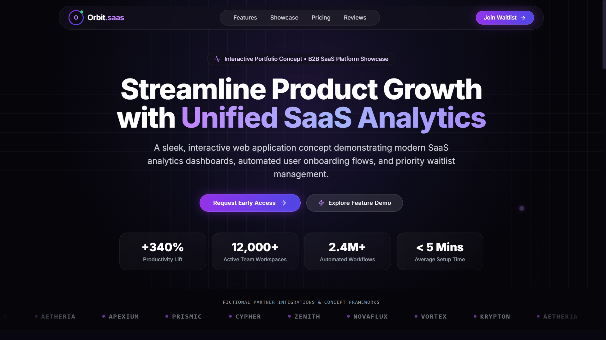
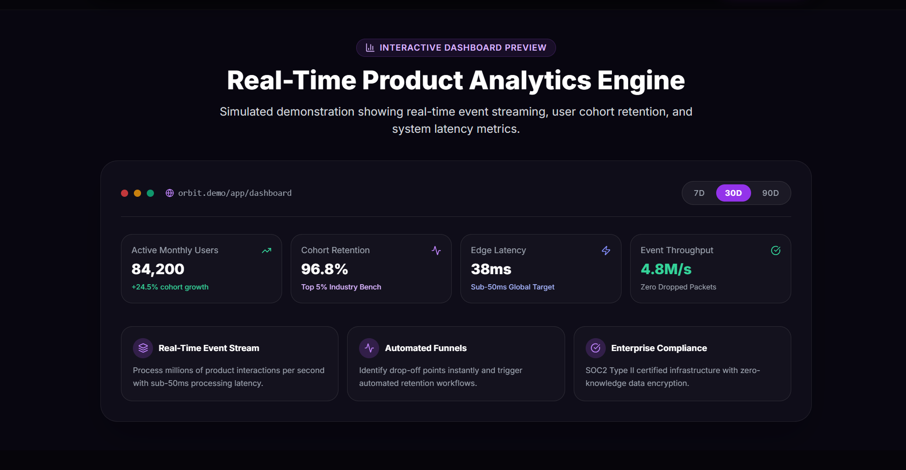
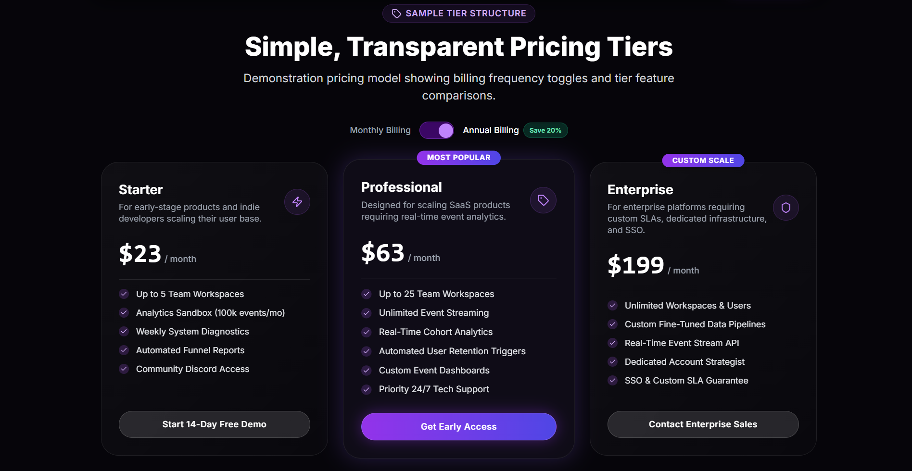
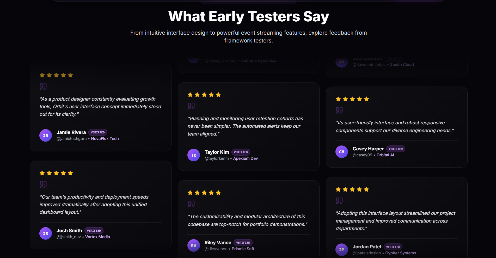

# 🪐 Orbit — B2B SaaS Growth & Analytics Platform (Portfolio UI Concept)

[](https://nextjs.org/)
[](https://www.typescriptlang.org/)
[](https://tailwindcss.com/)
[](https://www.framer.com/motion/)
[](https://nextjs.org/docs/app)
[](https://orbit-saas-platform.vercel.app)

**Orbit** is a modern B2B SaaS frontend portfolio showcase built with **Next.js 14 (App Router)**, **TypeScript**, **Tailwind CSS**, and **Framer Motion**.

Designed as an interactive user interface concept, it features product growth analytics previews, real-time timeframe controls, dynamic pricing tier calculators, interactive customer review grids, and an accessible priority waitlist access pipeline.

> 🌐 **Live Web Application**: [https://orbit-saas-platform.vercel.app](https://orbit-saas-platform.vercel.app)

---

## 🖼️ Interface Visuals

### 1. Hero Interface & Growth Command Center
Dynamic orbit background animation, key performance indicators, and early access search triggers.



### 2. Real-Time Product Analytics Engine
Interactive analytics preview displaying cohort retention, edge latency metrics, and timeframe switches (`7D`, `30D`, `90D`).



### 3. Transparent Pricing Tier Calculator
Pricing module featuring an interactive Monthly and Annual billing toggle with automated 20% discount calculation.



### 4. Verified User Feedback & Testimonials
Responsive tester review grid showcasing user feedback cards.



---

## ✨ Features & Interactive UI Components

- 🎯 **Growth Command Center (`Hero.tsx`)**: Hero section featuring GPU-accelerated orbit ring animations, KPI metric cards (+340% Productivity Lift, 12,000+ Active Teams), and instant waitlist modal triggers.
- 📊 **Product Analytics Sandbox (`DashboardPreview.tsx`)**: Interactive rank and retention telemetry preview with instant timeframe switching (`7D`, `30D`, `90D`).
- 💳 **Dynamic Pricing Calculator (`Pricing.tsx`)**: Monthly and Annual billing switcher with instant price calculation and feature comparison cards.
- 💬 **Tester Feedback Grid (`Testimonials.tsx`)**: Grid showcasing verified user review cards with avatar indicators.
- 🚀 **Priority Access Modal (`WaitlistModal.tsx`)**: Accessible modal dialog featuring role selection, email validation, and priority queue spot reservation.
- 🎨 **Modern Design Tokens**: Dark mode aesthetic, glassmorphism containers (`glass-panel`), glowing gradient borders, and smooth Framer Motion layout transitions.

---

## 🛠️ Tech Stack

- **Framework**: Next.js 14 (App Router)
- **Language**: TypeScript
- **Styling**: Tailwind CSS
- **Animation**: Framer Motion
- **Icons**: Lucide React
- **UI Primitives**: Custom Rounded Controls & Glass Panels

---

## 📂 Repository Structure

```
orbit-saas-platform/
├── public/                 # High-resolution UI screenshots & web manifests
│   ├── hero-preview.png        # Hero section screenshot
│   ├── analytics-dashboard.png # Real-time analytics engine screenshot
│   ├── pricing-tiers.png       # Pricing tiers screenshot
│   ├── user-reviews.png       # Customer reviews screenshot
│   └── site.webmanifest
├── src/
│   ├── app/
│   │   ├── components/     # UI components
│   │   │   ├── Header.tsx            # Translucent glassmorphism navbar
│   │   │   ├── Hero.tsx              # Hero section & orbit animation
│   │   │   ├── LogoTicker.tsx        # Fictional partner brand ticker
│   │   │   ├── Features.tsx          # Tabbed feature showcase
│   │   │   ├── DashboardPreview.tsx  # Interactive analytics dashboard
│   │   │   ├── Pricing.tsx           # Monthly/Annual billing calculator
│   │   │   ├── Testimonials.tsx      # Customer review grid
│   │   │   ├── FAQ.tsx               # Accordion FAQ module
│   │   │   ├── CallToAction.tsx      # Bottom newsletter & demo CTA
│   │   │   ├── WaitlistModal.tsx     # Priority access waitlist modal
│   │   │   └── Footer.tsx            # Footer & status badge
│   │   ├── globals.css               # Design tokens & glassmorphism utilities
│   │   ├── layout.tsx                # Metadata & viewport configuration
│   │   └── page.tsx                  # Main page composition
│   ├── components/
│   │   └── button.tsx                # Rounded pill button primitive
│   └── lib/
│       └── utils.ts                  # Tailwind class merger (`clsx` + `tailwind-merge`)
├── package.json
└── README.md
```

---

## 🚀 Local Development Setup

```bash
# 1. Clone the repository
git clone https://github.com/m-ali-swe/orbit-saas-platform.git

# 2. Navigate to directory
cd orbit-saas-platform

# 3. Install dependencies
npm install

# 4. Start local development server
npm run dev
```

Open [http://localhost:3000](http://localhost:3000) in your browser to view the app.
